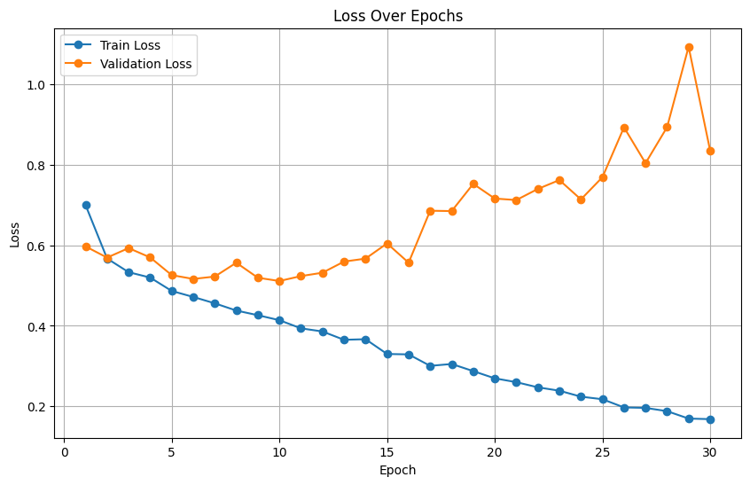
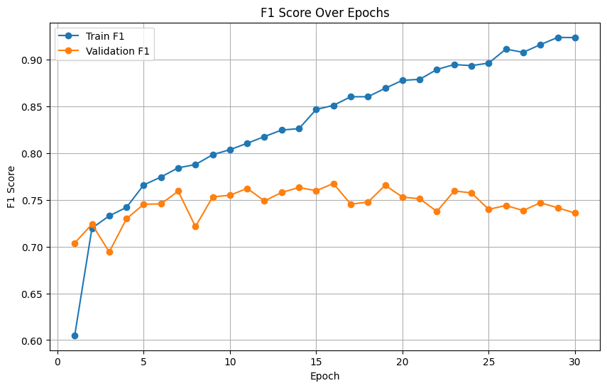

# 🌌 Cosmic-Curator

<!--  -->

## Overview
**Cosmic-Curator** is a simple ML project developed for **Hackrush 2025**, the annual hackathon organized by **IIT Gandhinagar**. 

> 🏆 **Awarded First Prize for the Astronomy Problem Statement at Hackrush 2025**

The objective of the project is to automate the classification of galaxy morphologies, specifically distinguishing between Spiral, Elliptical, and Uncertain galaxy types. 
<!-- This work is aligned with the goals of the International Virtual Observatory, which is currently processing an overwhelming volume of images from its latest deep-field astronomical survey. -->

Kaggle Competition: [Cosmic Curator](https://www.kaggle.com/competitions/cosmic-curator/overview)

## Problem Statement
The International Virtual Observatory has accumulated over 100,000 previously undocumented galaxy images. Given the scale of this dataset, manual classification is not a viable option. This project aims to develop a scalable, accurate, and efficient classification pipeline to aid in the automated processing and cataloging of galactic structures — a vital step toward advancing future galactic cartography and research.
>A total of 6,000 labeled images were provided as part of the Hackrush 2025 problem statement.

## Dataset

Dataset Link: [Cosmic Curator Dataset](https://www.kaggle.com/datasets/sharduljunagade/cosmic-curator)
<!-- 2. [Preprocessed Dataset with ](https://www.kaggle.com/datasets/sharduljunagade/my-cosmic) -->

The dataset is provided by the International Virtual Observatory. Each image is labeled as one of the following galaxy types:
- Spiral
- Elliptical
- Uncertain
## Model Architecture
- **Pre-trained Models**: ResNet-18, Swin-Tiny, Swin-Small, Swin-Base
- **Modified Fully Connected Layer**: The final fully connected layer is modified to output 3 classes corresponding to the galaxy types.

## Results
The **Swin Transformer**-based models consistently outperformed both the CNN baseline (ResNet-50) and other Swin variants. The best-performing model achieved a **macro F1-score of 0.80** on the hidden test set of the [Kaggle competition](https://www.kaggle.com/competitions/cosmic-curator/leaderboard).

### Best Model
You can download the best-performing model from [Kaggle Models](https://www.kaggle.com/models/sharduljunagade/cosmic-curator-best-model).

### Performance Plots
Below are the performance plots for the model:

#### Loss Curve

#### F1 Scores

## Future Work
- Extend the model to classify more galaxy types (e.g. irregular, lenticular).
- Incorporate additional preprocessing techniques for better feature extraction and noise reduction.
<!-- - Deploy the model as a web application for real-time classification. -->
- Wrap the whole thing in a web app for real-time use. Just drag, drop, and get your prediction.

## Acknowledgments
Big thanks to the Hackrush 2025 team, mentors, and everyone who made this event awesome.

## Author
- **Name**: Shardul Junagade
- **Email**: 23110297@iitgn.ac.in
- **Roll Number**: 23110297

## License
This project is licensed under the MIT License. See the [LICENSE](LICENSE) file for details.